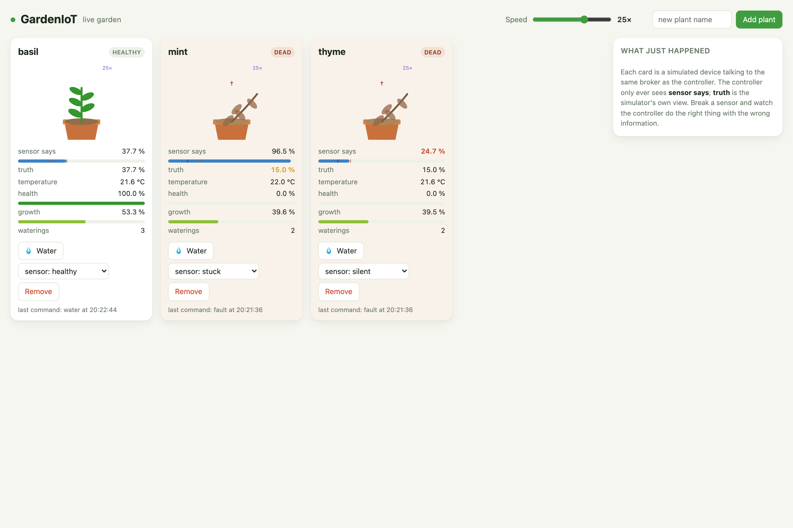
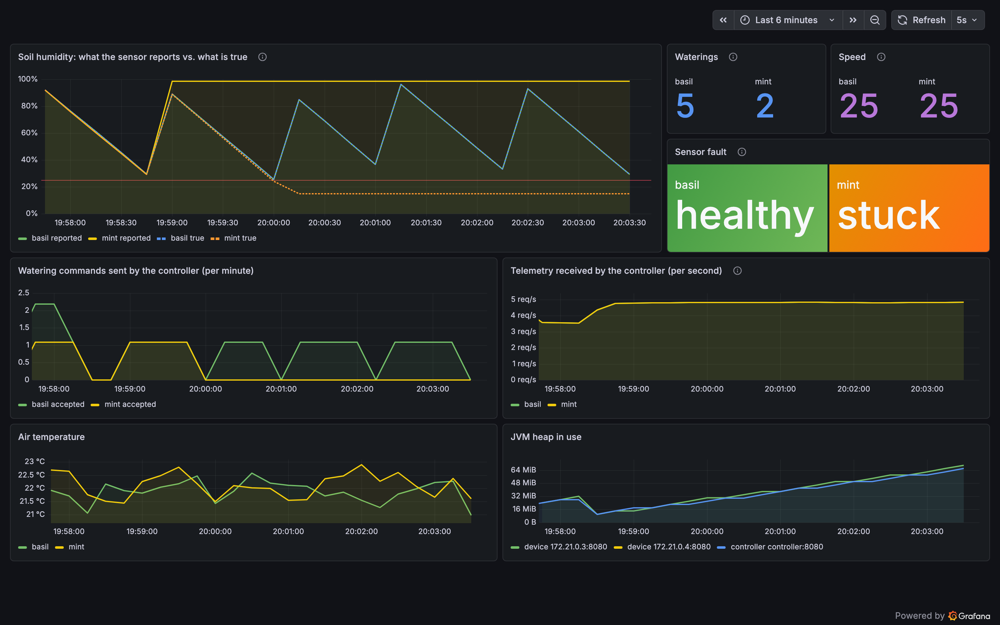

# GardenIoT

[](https://github.com/jehelmich/GardenIoT/actions/workflows/ci.yml)
[](https://github.com/jehelmich/GardenIoT/actions/workflows/codeql.yml)
[](LICENSE)

Automatic plant watering as a small, complete IoT system: simulated garden devices
report soil humidity, a cloud-side controller watches the stream and commands the
pump when a plant gets dry. It runs on a laptop with one command, on Kubernetes
with a Helm chart, or on Azure IoT Hub with Terraform — same code, different
transport.

```sh
docker compose up --build        # then open http://localhost:3000
```



*The garden page at <http://localhost:8088>, 25× speed, live weather from
Lisbon. Every species has its own comfort band (the green stripe) and the
controller waters each at its own threshold — the lavender is perfectly happy
at 17 %. Mint's sensor was frozen halfway through and repaired by the
technician in time. The prickly pear was watered twice by hand and died of
root rot.*



*The same story in Grafana: basil's sawtooth of drying and watering; mint's
reported humidity (solid) parting from the truth (dashed) the moment the
sensor stuck.*

A hobby project from July 2017, rebuilt in 2026 as a portfolio piece. See
[Status](#status) for what has and has not been verified.

## How it works

```
                 telemetry                          telemetry
   ┌────────────┐ ───────▶ ┌─────────────────────┐ ───────▶ ┌────────────┐
   │  device(s) │          │  transport           │          │ controller │
   │            │ ◀─────── │  MQTT broker  - or - │ ◀─────── │            │
   │ Plant-     │ commands │  Azure IoT Hub       │ commands │ Watering-  │
   │ Simulation │          └─────────────────────┘          │ Policy     │
   └─────┬──────┘                                            └─────┬──────┘
         │ /metrics                                                │ /metrics
         └──────────────▶  Prometheus  ──▶  Grafana  ◀─────────────┘
```

1. Every few seconds each **device** advances its `PlantSimulation` — soil dries
   with temperature, species and weather; rain puts water back — reads its
   sensor and publishes a JSON reading. The plant has a species with real needs
   (a basil, a fern and a cactus want very different soil), health and growth;
   it dies of thirst, root rot, frost or heat. The sensor can be broken on
   command — stuck, over-reading or silent — while the plant keeps drying
   underneath; a technician can be sent to replace it.
2. Each device reports its **watering profile** as state — a reported property
   on the IoT Hub device twin, a retained topic on MQTT. The **controller**
   subscribes to every device's telemetry, looks the profile up, and hands each
   reading to a `WateringPolicy`: below *that plant's* threshold, water — but not
   more than once per cooldown, because the next readings still show dry soil
   while the pump runs.
3. The controller sends the `water` **command**. The device acknowledges with
   `202 Accepted`, runs the pump on a background thread, soaks the soil, and
   reports `lastWater` as device state. Direct method on IoT Hub, request/response
   over MQTT 5 — the application code does not know which.
4. Both processes expose Prometheus metrics. The device also exposes the
   simulator's **ground truth** next to what its sensor claimed, which is how the
   dashboard shows a lying sensor.
5. The **garden page** watches the same broker and renders every plant live:
   it grows while the soil is comfortably damp, wilts as its health drains, and
   dies when it reaches zero. From the page you can water, break a sensor, call
   the technician, repot, add species, set the weather — fixed, changing, or
   live from any place on Earth via Open-Meteo — and run the whole simulation
   up to 50×. A small game that shows what the loop does, and what it cannot
   know.

The applications talk to *ports* (`DeviceTransport`, `TelemetrySource`,
`DeviceCommandSender`); `transport-mqtt` and `transport-azure` are the adapters.
`TRANSPORT=mqtt|azure` picks one at start-up. Details and the reasons behind the
design are in [docs/architecture.md](docs/architecture.md) and the
[decision records](docs/adr/).

## Repository layout

```
common/            Telemetry contract, transport ports, configuration and metrics helpers
transport-mqtt/    MQTT 5 adapter (HiveMQ client): topics, request/response, last will, fleet channel
transport-azure/   Azure IoT Hub adapter: Entra ID or connection strings, direct methods, twins
simulated-device/  A fleet of virtual plants with sensor faults and runtime speed control
controller/        The watering loop
garden-ui/         The live garden page: bus observer, server-sent events, JSON API, one HTML file
integration-tests/ The loop end to end against Mosquitto in Testcontainers
deploy/helm/       Helm chart; also the source of the broker, Prometheus and Grafana config
deploy/terraform/  Azure: IoT Hub, managed identity, Container Apps
scripts/           kind-up.sh, kind-down.sh, deploy-azure.sh
docs/              Architecture, decision records, images
```

## Running it

### On a laptop (Docker Compose)

```sh
docker compose up --build
```

Brings up Mosquitto, the controller, a device process hosting `basil` and
`mint`, the garden page, Prometheus and Grafana:

| | |
|---|---|
| <http://localhost:8088> | the garden page — watch, water, break sensors, add plants, change speed |
| <http://localhost:3000> | Grafana, no login, dashboard provisioned |
| <http://localhost:9090> | Prometheus |

Everything the page does is also a plain MQTT 5 request you can send yourself:

```sh
# 25x speed, break mint's sensor, make it rain
docker compose exec mosquitto mosquitto_pub -t garden/basil/cmd/setSpeed   -m '{"factor":25}'
docker compose exec mosquitto mosquitto_pub -t garden/mint/cmd/fault       -m '{"type":"STUCK"}'
docker compose exec mosquitto mosquitto_pub -t garden/mint/cmd/setWeather  -m '{"mode":"rain"}'

# a third device process with its own plant
docker compose run -d -e DEVICE_IDS=thyme device
```

### On Kubernetes (kind + Helm)

```sh
scripts/kind-up.sh      # builds images, creates a kind cluster, installs deploy/helm/gardeniot
scripts/kind-down.sh
```

The chart runs devices as a StatefulSet (pod *N* hosts `device.plants[N]`),
the controller as a single-replica Deployment, and optionally Prometheus and
Grafana. Pods run as non-root with a read-only root filesystem; liveness and
readiness probes use `/healthz` and `/readyz`. Every value, including the Azure
profile, is documented in [`values.yaml`](deploy/helm/gardeniot/values.yaml).

### On Azure (Terraform)

```sh
az login
scripts/deploy-azure.sh           # IoT Hub (free tier), managed identity, two Container Apps
scripts/deploy-azure.sh destroy
```

The controller authenticates to the hub with a managed identity and Entra ID
roles — there is no key anywhere in its configuration. The device, like a real
one, uses its own device credential. See
[deploy/terraform/azure/README.md](deploy/terraform/azure/README.md).

### From source

JDK 21 or newer; Maven comes with the wrapper.

```sh
./mvnw verify                 # format check, unit tests, integration tests (needs Docker), jars
./mvnw verify -DskipITs       # without Docker
java -jar controller/target/controller.jar
java -jar simulated-device/target/simulated-device.jar
```

## Configuration

Everything comes from the environment. Connection strings never live in a file
in this repository.

| Variable | Process | Meaning |
|---|---|---|
| `TRANSPORT` | both | `mqtt` (default) or `azure` |
| `METRICS_PORT` | both | Port for `/metrics`, `/healthz`, `/readyz`; default `8080`, `0` disables |
| `HUMIDITY_THRESHOLD` | controller | Water below this soil humidity in percent; default `25` |
| `WATERING_COOLDOWN_SECONDS` | controller | Minimum time between two watering commands to one device; default `15` |
| `DEVICE_IDS` | device | Comma-separated plants to host; default: one named after the machine |
| `PLANT_NAMES`, `PLANT_INDEX` | device | For replicas: this replica hosts `PLANT_NAMES[PLANT_INDEX]` |
| `TELEMETRY_INTERVAL_SECONDS` | device | Seconds between readings at speed 1; default `5` |
| `ACTION_DURATION_SECONDS` | device | How long the pump and a reboot take at speed 1; default `5` |
| `WEATHER` | device | `clear`, `rain`, `drought`, `heatwave`, `cold`, `auto` (changes by itself) or `real`; default `clear`, compose uses `auto` |
| `WEATHER_LATITUDE`, `WEATHER_LONGITUDE`, `WEATHER_PLACE` | device | Where `real` weather is fetched for (Open-Meteo, no key) |
| `UI_PORT` | garden-ui | Port of the page (with `/metrics` and health on it); default `8080`, compose maps it to 8088 |

MQTT transport:

| Variable | Meaning |
|---|---|
| `MQTT_HOST`, `MQTT_PORT` | Broker; default `localhost:1883` |
| `MQTT_TLS`, `MQTT_USERNAME`, `MQTT_PASSWORD` | Optional TLS and credentials |
| `MQTT_TOPIC_PREFIX` | First topic segment; default `garden` |
| `MQTT_COMMAND_TIMEOUT_SECONDS` | How long the controller waits for a device to answer; default `10` |

Azure transport, controller — Entra ID (preferred) or connection strings:

| Variable | Meaning |
|---|---|
| `AZURE_IOTHUB_HOSTNAME` | `<hub>.azure-devices.net`; authenticates with `DefaultAzureCredential` |
| `AZURE_EVENTHUB_NAMESPACE`, `AZURE_EVENTHUB_NAME` | The built-in endpoint, likewise |
| `IOTHUB_SERVICE_CONNECTION_STRING` | Fallback: shared access policy with *service connect* |
| `EVENTHUB_COMPATIBLE_CONNECTION_STRING` | Fallback: connection string of the built-in endpoint |
| `EVENTHUB_CONSUMER_GROUP` | Default `$Default` |

Azure transport, device: `IOTHUB_DEVICE_CONNECTION_STRING` (the device id is
taken from it) and optionally `IOTHUB_DEVICE_PROTOCOL` (`MQTT`, `MQTT_WS`,
`AMQPS`, `AMQPS_WS`).

## Commands a device understands

| Command | Payload | Effect |
|---|---|---|
| `water` | – | `202`; runs the pump, adds a dose to the soil |
| `reboot` | – | `202`; restarts, reports `lastReboot` |
| `repairSensor` | – | `202`; a technician recalibrates or replaces the sensor after a while (`409` if a job is under way) |
| `repot` | – | `202`; a fresh seedling of the same species (`409` if a job is under way) |
| `setSpeed` | `{"factor": 25}` | Runs the simulation faster (0.1–100×) |
| `fault` | `{"type": "STUCK"}` | `NONE`, `STUCK`, `OVERREAD` or `SILENT` sensor |
| `setWeather` | `{"mode": "rain"}` or `{"mode": "real", "latitude": 38.7, "longitude": -9.1, "place": "Lisbon"}` | Fixed, `auto`, or live weather |
| `status` | – | The simulator's view: species, true humidity, health, growth, weather, jobs, waterings |

Fleet commands (MQTT only, any device process picks them up): `addPlant`
(`{"deviceId": "thyme", "profile": "cactus"}` — a plant named after a species
becomes that species), `removePlant`, `listPlants`, `listProfiles`.

The garden page wraps the same commands in a JSON API: `GET /api/profiles`,
`POST /api/plants`, `DELETE /api/plants/{id}`,
`POST /api/plants/{id}/commands/{name}`, `POST /api/speed`, `POST /api/weather`
(a place name is geocoded first); `GET /events` is the server-sent event stream
the page renders from.

## Engineering notes

- **Ports and adapters, for a reason.** The original IoT Hub deployment is long
  gone; putting the transports behind three small interfaces is what lets the
  same loop run against Mosquitto on a laptop and IoT Hub in Azure, and what
  makes the unit tests hub-free.
- **The wire contract is a record.** `Telemetry` in `common` is serialised and
  parsed with one codec that rejects malformed and out-of-range documents.
- **Per-device configuration lives on the twin.** A plant's needs travel as a
  reported property (`WateringProfile`), and the controller reads them through
  a port — the same shape on IoT Hub (twin) and MQTT (retained topic).
- **Identity over secrets.** On Azure the service side uses `DefaultAzureCredential`
  — managed identity in the cloud, the developer's login locally — with
  connection strings only as a fallback. Device identity comes from what the
  broker asserts (hub system property, MQTT topic), not from the message body.
- **Defensive loop.** Unreadable messages, failed twin updates and rejected
  commands are logged and skipped; long commands are acknowledged at once and
  executed off the callback thread. Both entry points shut down cleanly and the
  controller exits non-zero if its stream dies.
- **Tests at three levels.** Unit tests with injected clocks and fakes;
  integration tests that run the loop against a real broker; a CI smoke test
  that installs the chart on kind and waits for the first watering.
- **Supply chain.** Formatting enforced, coverage reported, CodeQL and Trivy in
  the Security tab, multi-arch images signed with Sigstore, Dependabot on Maven,
  Actions and base images.

## Status

The 2017 version ran against a real IoT Hub with physical sensors on the
device. This repository's simulated device stands in for that hardware — same
message contract, same commands — so that the whole system can be run and
demonstrated anywhere; a real sensor would plug in behind `PlantSimulation`'s
`Reading`.

Verified: the build, unit and integration tests; the compose stack including
the garden page and live weather; the Helm chart on kind, with metrics scraped
in-cluster; the MQTT transport end to end.
The Azure transport compiles against the current SDKs, its settings are unit
tested, and the Terraform configuration validates — but neither has been run
against a live subscription since the 2017 original. That is the next thing to
do with a free-tier hub.

## License

[Apache License 2.0](LICENSE).
